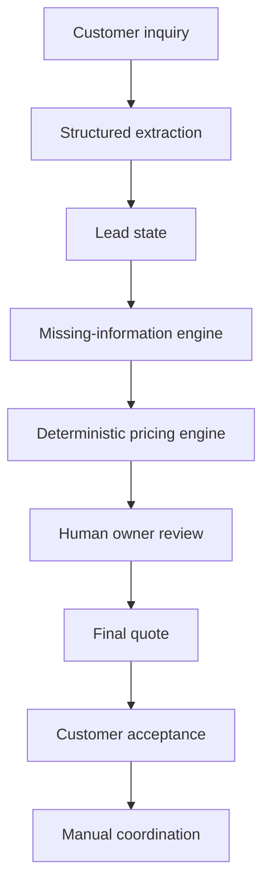
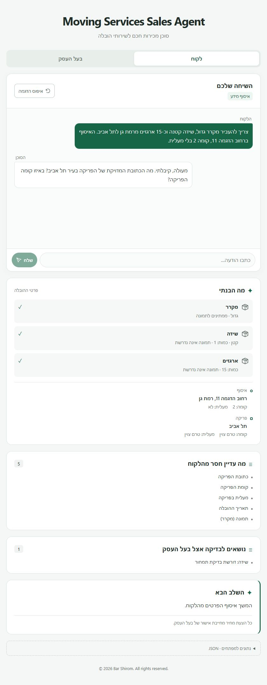

# Moving Services Sales Agent

Human-in-the-loop AI sales agent for moving services.

A Hebrew customer conversation becomes a structured lead, a pricing recommendation and an
owner-approved quote. The local React demo follows the process through customer acceptance,
with manual coordination still pending. Rick & GO provides the current pilot's business context.

[Run locally](#run-locally) · [Product flow](#product-flow) · [Project status](#current-project-status) · [More detail](#more-detail)

## What it does

- Understands natural Hebrew messages about inventory, access and service needs.
- Turns customer messages into structured move details while retaining known facts.
- Asks for missing information and handles corrections or unavailable details.
- Produces deterministic recommendations with a breakdown and unpriced components.
- Routes every quote through owner approval.
- Records acceptance of the final quote and prepares a manual-coordination summary.

## Why I built it

Moving leads often arrive as unstructured, WhatsApp-style messages. Customers send information
out of order, correct themselves and may not know every detail. I built this project to explore
how AI can understand the conversation while deterministic code and human approval remain
responsible for business decisions.

## Product flow



## Key engineering decisions

### LLM for extraction only

OpenAI Structured Outputs converts natural language into schema-constrained facts.
Zod and domain validation check the result before it updates the Lead.
A valid response shape does not guarantee that every extracted fact is correct.

The model does not:

- Calculate prices.
- Approve quotes.
- Control lifecycle state.
- Automatically send customer quotes.

### Deterministic pricing

<a id="pricing-engine-v01-complete-and-partial-recommendations"></a>
<a id="provisional-pricing-assumptions"></a>

Versioned rules produce explainable breakdowns, ranges and complete or partial recommendations.
Unsupported components stay visible for manual pricing. Rules remain provisional; box and distance
rates are engineering assumptions. The [pricing audit](data/evals/PRICING_EVIDENCE.md#current-pricing-engine-audit)
contains the tariffs, evidence and composition limits.

### Human in the loop

The owner can approve, adjust, request more information or take over. A calculated subtotal and
a final commercial quote are separate records. Partial pricing requires explicit whole-job
finalization, and changed scope cannot silently accept an old quote.

### Eval-driven development

Observed bugs become regression cases, including date handling, unavailable dimensions and
contextual quote acceptance. Offline tests, conversation evals and pricing evidence check different
parts of the system. The [eval guide](data/evals/README.md) explains coverage and remaining gaps.

## Demo flow

1. The customer describes a move in Hebrew.
2. The agent extracts known details and asks for missing information.
3. The pricing engine calculates the supported portion of the move.
4. The owner reviews omitted work and confirms the final price.
5. The customer accepts the current quote.
6. The lead remains pending manual coordination, without a reserved date or crew.

Unsupported pricing components remain visible to the owner.
The [offline walkthrough](docs/ENGINEERING_GUIDE.md#offline-demo-walkthrough) includes exact messages
and a partial-subtotal-to-final-quote example.

## Current project status

Working local v0.1 demo. Verified on **2026-10-07**:

- **419 automated tests passed:** 379 server and 40 frontend.
- **Conversation evals:** 24 passed, 0 failed; two future-service cases not run.
- **Pricing evals:** six evaluated, five partial and one unsupported; zero invalid,
  with no complete whole-job accuracy scores.

Tests use injected extraction/provider responses. They do not measure live Hebrew extraction
accuracy, production usage or commercial impact.

## Tech stack

- **Client:** React 19, TypeScript, Vite 6, CSS and Hebrew RTL.
- **Server:** Node.js, Express 5 and strict TypeScript.
- **AI boundary:** OpenAI Responses API, Structured Outputs and Zod 4.
- **Tests:** Node's built-in test runner through `tsx`, React DOM and JSDOM.
- **Tooling:** npm workspaces and Git.

## Demo screenshots

Real browser captures of the local offline demo with synthetic data, not production usage.

### Customer conversation



Natural Hebrew conversation is converted into structured move details while the agent asks only for missing information.

### Owner pricing and review


The deterministic Pricing Engine exposes the calculated subtotal, pricing range, information-completeness confidence and components that still require manual review.

### Customer acceptance


After owner finalization, the customer accepts the approved quote and the lead moves to pending manual coordination.

See the full five-step demo flow in [docs/screenshots/README.md](docs/screenshots/README.md).

## Run locally

Requires Node.js 20.18+ and npm 9+. On Windows, use `npm.cmd` if PowerShell blocks `npm.ps1`.

### Offline demo

```sh
npm install
npm run build
npm run demo:quote --workspace server
```

Open **http://127.0.0.1:3101**. No API key or OpenAI calls are needed.
Use the [documented fixture messages](docs/ENGINEERING_GUIDE.md#offline-demo-walkthrough);
this mode does not handle arbitrary free-form input.

### Development with OpenAI

After installing dependencies, copy `.env.example` to a root `.env` and set `OPENAI_API_KEY`.
The key stays server-side, never in a `VITE_` variable.

```sh
npm run dev:server
# In a second terminal:
npm run dev:client
```

Open **http://localhost:5173** (or Vite's reported port). Customer messages can make real provider
requests. See the [engineering guide](docs/ENGINEERING_GUIDE.md#running-and-configuration)
for configuration, API routes, validation commands and build details.

For local backend container verification, see the [Docker deployment guide](docs/DEPLOYMENT.md).
It covers production image packaging and future ECR/ECS preparation; no cloud deployment is included.

## Current limitations

- In-memory, single-session demo; resetting or restarting clears its state.
- No persistent database or authentication.
- No WhatsApp integration yet.
- Provisional pricing; unsupported furniture may require manual pricing.
- No real maps, availability checks or scheduling integration.

## Roadmap

- Persistent storage and audit history.
- WhatsApp Business integration.
- Maps and distance integration.
- Pilot feedback and stronger pricing evidence.
- Production deployment and security.

## More detail

- [Engineering guide](docs/ENGINEERING_GUIDE.md)
- [Portfolio summary and CV copy](docs/PORTFOLIO_SUMMARY.md)
- [Interview notes](docs/INTERVIEW_NOTES.md)
- [Pricing evidence](data/evals/PRICING_EVIDENCE.md)
- [Eval documentation](data/evals/README.md)
