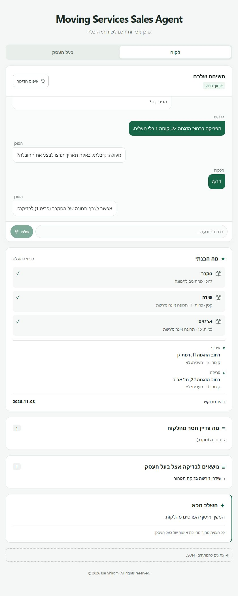
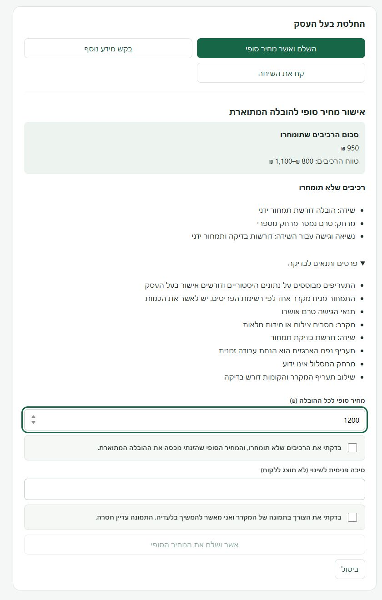

# Five-step demo flow

Real browser screenshots of the local offline demo using synthetic data and extraction fixtures, not production usage or live LLM calls.
In the OpenAI path, the LLM extracts structured facts; deterministic code manages lead state and pricing. Owner approval is mandatory for every quote.

## 1. Customer conversation

The agent retains the inventory and pickup facts from the customer's Hebrew message and asks for missing dropoff details.
The view separates customer information still needed from items requiring owner pricing review.

## 2. Structured lead

The lead retains both access endpoints and normalizes `8/11` to `2026-11-08` in the fixture's reference year.
The next question requests the refrigerator photo, demonstrating that known details are retained while outstanding requirements stay visible.

## 3. Owner pricing and review

Deterministic rules produce a ₪950 partial subtotal, a ₪800 to ₪1,100 component range and a 30% information-completeness score, not a statistical accuracy estimate.
Unpriced dresser, distance and access work remains visible for manual review; the subtotal is not the final commercial quote.

## 4. Owner finalization

The owner enters ₪1,200 as the final whole-job price while the original ₪950 subtotal and omitted components remain visible.
Sending stays disabled until the owner explicitly confirms coverage of omitted costs and approval to proceed without the photo.

## 5. Accepted quote awaiting coordination

The customer has accepted the owner-approved ₪1,200 quote, with scope, unresolved details and owner acknowledgements preserved for manual coordination.
No date or crew is reserved, and the original ₪950 engine subtotal remains separate from the accepted price.

Follow the [offline walkthrough](../ENGINEERING_GUIDE.md#offline-demo-walkthrough) to reproduce the flow, or return to the [project README](../../README.md).
